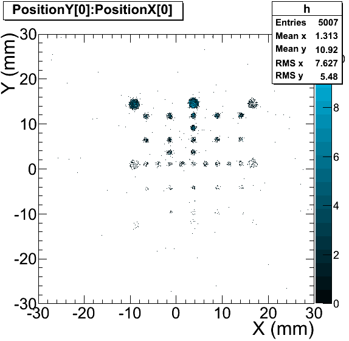

README file for running NPTool benchmarks
=========================================

Contents
--------

1. [Why benchmarks?](#why-benchmarks?)
2. [Prerequisities](#prerequisities)
3. [CATS: a multi-wire low-pressure tracking system](#cats:-a-multi-wire-low-pressure-tracking-system)
4. [GASPARD: a silicon array for particle spectroscopy](#gaspard:-a-silicon-array-for-particle-spectroscopy)


## Why benchmarks?
Benchmarks play an important role to check the installation or upgrade integrity
of the NPTool package. They are also useful for comparing CPU performances on
different computer platforms. So far two benchmarks are included in the NPTool
package. The first one analyses experimental data from a beam tracker detector
using the _npanalysis_ facility, while the second one runs a silicon array
simulation using the _npsimulation_ facility and display some basics
control spectra. Each benchmark produces figures that can be compared to the
reference figures provided in NPTool. These two benchmarks cover all the core
functionalities of NPTool's framework.


## Prerequisities
You need to download additional files to be able to run the benchmarks. In the
$NPTOOL directory, do the following:

```
$ git clone https://github.com/adrien-matta/NPData

```


## CATS: a multi-wire low-pressure tracking system
CATS consists of two low pressure multi-wire proportional chambers with one plane
of anode wires placed between two cathode planes, respectively segmented into 28
vertical or horizontal strips \cite{Ott99}. It was designed to provide
event-by-event particle tracking in experiments with radioactive beams at GANIL.

The benchmark can be run from the $NPTOOL/Benchmarks/cats directory with the 
following command:
```
$  npanalysis -D benchmark_cats.detector -C calibration.txt -R RunToTreat.txt -O benchmark_cats
```

To display the results run the command:
```
$ root -l ShowResult.C
```

Alternatively to the two previous commands, you can run the `benchmark_cats.sh` 
script which runs the analysis and display the results.



Experimental data for the present benchmark comes from the interaction of a
<sup>58</sup>Ni ion beam at 75 MeV/u in a CATS detector. A mask with a known
pattern was inserted in front of it in order to calibrate the position
reconstruction. Results that should be obtained when running the benchmark
are shown in Fig.~\ref{f:cats}. The mask pattern including circular holes of
different diameters is clearly observed.
Aside from testing the position reconstruction for the CATS
detector, this benchmark validates the calibration manager facility and the
_npanalysis_ utility.


### GASPARD: a silicon array for particle spectroscopy
